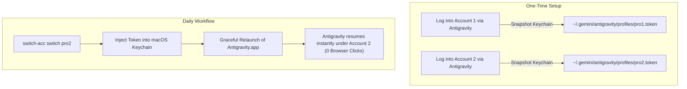

# Antigravity Account Switcher (`switch-acc`)

[](https://apple.com)
[](https://www.zsh.org/)
[](https://opensource.org/licenses/MIT)

A lightweight, zero-dependency profile switcher for the standalone **Google Antigravity Desktop App** (`com.google.antigravity`) on macOS. 

Switch between multiple Gemini Pro / Advanced accounts in under 2 seconds **without logging in via browser again**.

---

## The Problem

The official Google Antigravity desktop application stores its active OAuth session in the **macOS Keychain** (`service=gemini`, `account=antigravity`). Because the application only supports one active credential at a time, hitting rate limits or weekly quotas requires:

1. Signing out of the application.
2. Undergoing the browser-based Google OAuth redirect flow.
3. Granting permissions again every time you need to switch accounts.

VS Code extensions (e.g. `.vsix`) do not work because the standalone Antigravity application does not run a VS Code extension host.

---

## The Solution

`switch-acc` intercepts authentication at the OS Keychain layer:



---

## Features

- **Zero Browser Re-Authentication:** Save each account once; switch seamlessly afterwards.
- **Automatic Email Discovery:** Decodes and displays the Google Account email directly from the OAuth JWT `id_token`.
- **Timestamp Tracking:** Tracks both `DATE ADDED` and `LAST SWITCHED` timestamps for quota monitoring.
- **Antigravity Skill Integration:** Switch accounts remotely via AI prompt in web or desktop sessions.
- **Zsh Tab-Autocompletion:** Supports `switch-acc switch <TAB>` and `switch-acc delete <TAB>`.
- **Zero External Dependencies:** Built with pure Zsh and native macOS binaries (`/usr/bin/security`).
- **Completely Isolated:** Tokens are stored locally under strict `0700` and `0600` permissions.

---

## Installation

### Quick Install (Git Clone)

```bash
git clone https://github.com/vinhthang/antigravity-account-switcher.git
cd antigravity-account-switcher
./install.sh
```

### Optional: Enable Tab Autocompletion in Zsh
Add the following line to your `~/.zshrc`:
```zsh
source "$HOME/.local/bin/switch-acc"
```
Then reload your terminal:
```zsh
source ~/.zshrc
```

---

## Usage

### 1. Save Profiles (One-Time Enrollment)

1. Open `Antigravity.app` and log into your first Google account.
2. Snapshot the profile:
   ```bash
   switch-acc save acc1
   ```
3. In `Antigravity.app`, sign out and log into your second Google account once.
4. Snapshot the second profile:
   ```bash
   switch-acc save acc2
   ```

---

### 2. View Profiles (`switch-acc list`)

View active state, account emails, token checksums, and switch history:

```text
$ switch-acc list
Saved Antigravity Profiles:
--------------------------------------------------------------------------------------------------------------------------------
STATUS     PROFILE NAME     EMAIL                            TOKEN HASH       DATE ADDED             LAST SWITCHED         
--------------------------------------------------------------------------------------------------------------------------------
           acc1             user.one@example.com             13d99dc2c371     2026-09-25 18:32:05    2026-09-25 18:32:05   
[ACTIVE]   acc2             user.two@example.com             cd77812a0a8b     2026-09-25 18:37:58    2026-09-25 18:41:20   
--------------------------------------------------------------------------------------------------------------------------------
```

#### Markdown Output (`--markdown` or `--md`)
Format the profile list directly as a GitHub Flavored Markdown table:

```bash
switch-acc list --markdown
```

---

### 3. Switch Profiles (`switch-acc switch`)

When your current account hits a model rate limit or quota:

```bash
switch-acc switch acc1
```

**What happens:**
1. Injects `acc1`'s token into the macOS Keychain (`service=gemini`, `account=antigravity`).
2. Records the timestamp to `~/.gemini/antigravity/profiles/acc1.last_switched`.
3. Gracefully closes `Antigravity.app` and relaunches it.
4. The window reopens authenticated under `acc1` within ~2 seconds.

#### Switch without Restarting
If you prefer to restart the application manually later:
```bash
switch-acc switch acc1 --no-restart
```

#### Non-blocking Detached Restart (for Remote Web Sessions)
When switching from an Antigravity agent session or web interface:
```bash
switch-acc switch acc1 --detached
```
Schedules a 2-second background restart, allowing the active command process to return cleanly before Antigravity restarts and reconnects.

---

### 4. Delete Profiles

```bash
switch-acc delete acc1
```

---

## Antigravity Skill Integration (Remote Web Switching)

`switch-acc` includes a native **Antigravity Skill** (`antigravity-account-switcher`) installed to `~/.gemini/config/skills/antigravity-account-switcher/SKILL.md`.

This enables the AI agent in both desktop and remote web sessions ([antigravity.google.com](https://antigravity.google.com)) to inspect accounts and switch profiles directly on conversational request:

- **List Profiles via Chat:** *"Which accounts do I have?"* or *"List available Antigravity accounts"* &rarr; The agent executes `switch-acc list --markdown` and reports the active profile and associated emails.
- **Switch Account via Chat:** *"Switch to acc2"* &rarr; The agent executes `switch-acc switch acc2 --detached`. The token is updated in the macOS Keychain, and Antigravity restarts cleanly in the background and reconnects automatically without breaking the session.

---

## Security & Privacy Model

- **Local Storage Only:** Stored tokens reside strictly on your local machine at `~/.gemini/antigravity/profiles/`.
- **File System Permissions:** The storage directory is locked down with POSIX permissions `0700` (user read/write/execute only) and individual token files with `0600` (user read/write only).
- **No Network Telemetry:** The tool performs zero external network calls; token refreshes are performed directly by Google Antigravity against official Google OAuth endpoints.

---

## Authorship & Credits

- **Architecture & Implementation:** Gemini 3.8 Flash (Google DeepMind)
- **Concept & Testing:** Vinh Thang ([@vinhthang](https://github.com/vinhthang))

---

## License

MIT License. See [LICENSE](LICENSE) for details.
